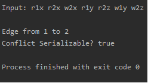
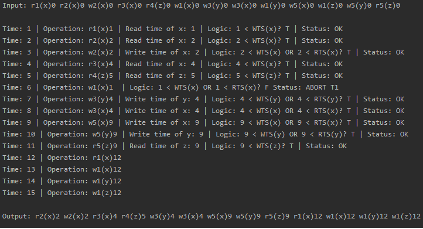
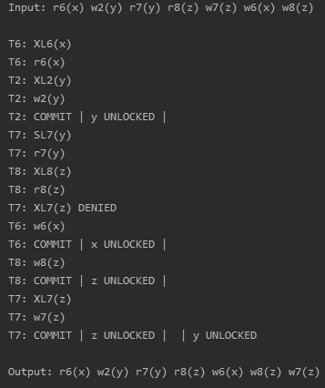

# DBMS Concurrency Control
## Overview

Early in the second year of my IT degree, I learned about concurrent database transactions, focusing on common algorithms that can be used to help with concurrency. The algorithms serve different purposes and focus on 
topics such as precedence graphs, timestamping and two-phase-locking. To help myself truly understand these concepts and test my programming skills, I decided to implement 
these algorithms using Java. I implemented an algorithm to determine whether a series of transactions are conflict serializable, another algorithm to serialize transactions 
using timestamping, and lastly, an algorithm to serialize transactions using two-phase locking. Implementing these algorithms into my own personal program not only helped me 
understand these concepts in depth, but also helped me gain a bit more experience in writing code without any external guidance.

## Input

The program itself is quite simple, allowing the input of a series of transactions into one of the three algorithms, with the output being printed onto the console.

The input is entered in the following format: "r6(x) w2(y) r7(y) r8(z) w7(z) w6(x) w8(z)".

* The letters 'r' and 'w' represent whether the operation is read or write.
* The number following the operation represents the transaction ID.
* The letter inside the paranthesis represents the identifier of the data that is being operated on.

The program parses this input and creates the relevant objects necessary to run the algorithm.

## Testing Conflict Serializability

This algorithm is based on [precedence graphs for testing conflict seializability in DBMS](https://www.geeksforgeeks.org/precedence-graph-for-testing-conflict-serializability-in-dbms/).
The algorithm finds each edge on the predence graph based on the input, determines whether the graph is cyclic or acyclic, and the output of the program simply displays all the edges on the graph, 
while also indicating whether the schedule is conflict serializable or not.

## Timestamping Algorithm

This algorithm is based on the [timestamp ordering protocol](https://www.geeksforgeeks.org/timestamp-based-concurrency-control/), which provides an excellent method to ensure that a schedule is free
from [deadlocks](https://docs.oracle.com/javadb/10.10.1.2/devguide/cdevconcepts28436.html). The output provides step-by-step insight into the decisions made by the algorithm, the logic used to make
those decisions, as well as the final serialized schedule.

## Two-Phase Locking Algorithm

This algorithm is based on the [two-phase locking (2-PL) protocol](https://www.geeksforgeeks.org/two-phase-locking-protocol/), more specifically, [strict 2-PL](https://www.geeksforgeeks.org/categories-of-two-phase-locking-strict-rigorous-conservative/),
which is recoverable and cascadeless, but still vulnerable to deadlocks. The output displays each transaction step-by-step, exclusive and shared locks and their impact on other transactions, as well as the serialized schedule.

